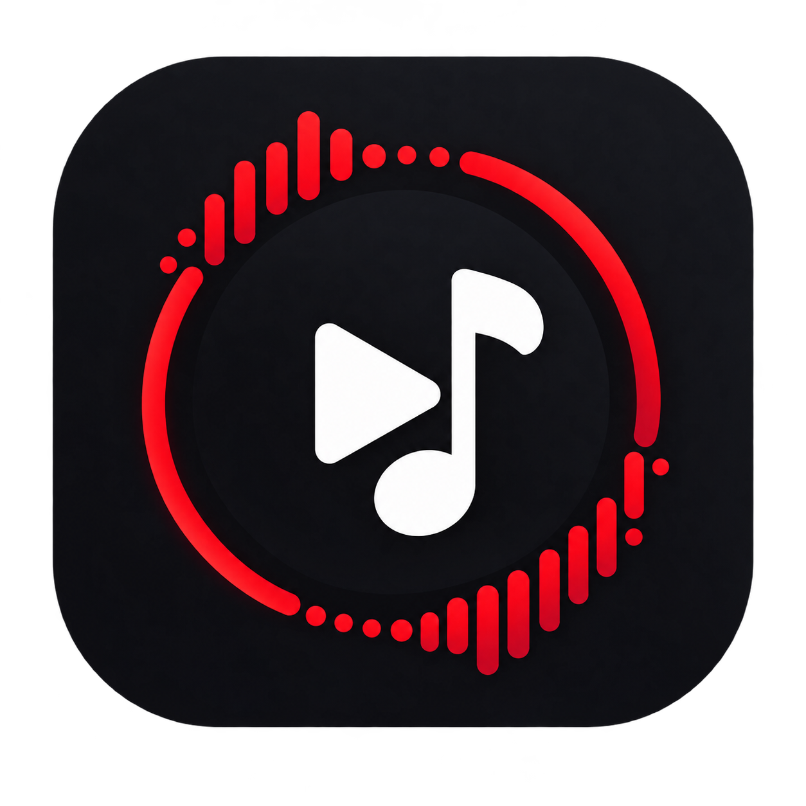
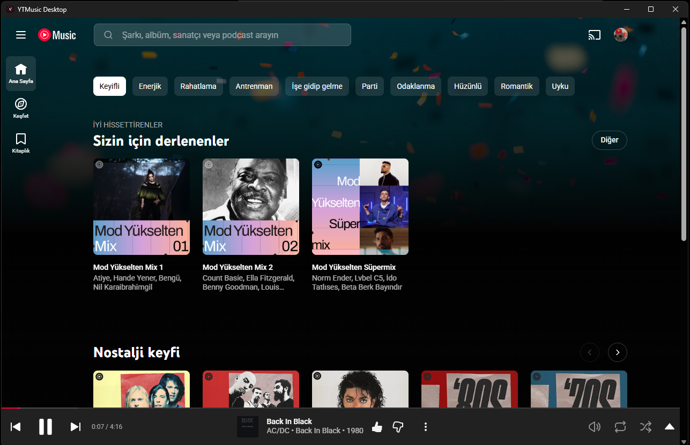
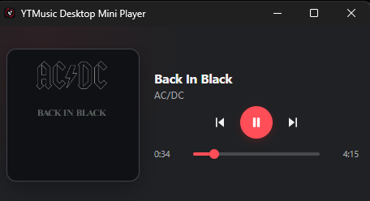
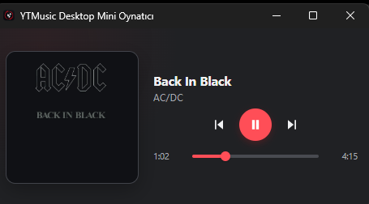
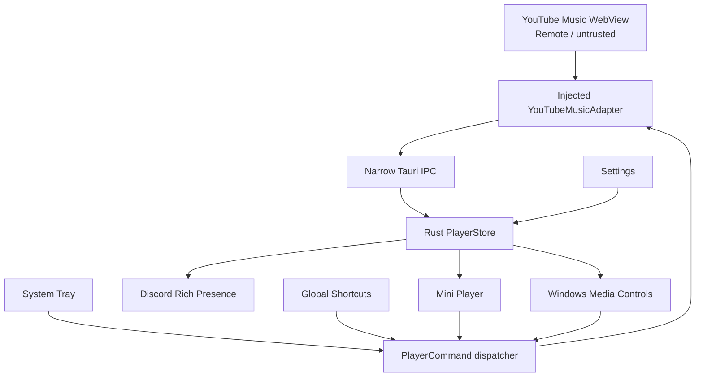

<p align="center">
  
</p>

<h1 align="center">YTMusic Desktop</h1>

<p align="center">
  A lightweight desktop client for YouTube Music built with Tauri, Rust and TypeScript.
</p>

<p align="center">
  <a href="https://github.com/KurKigal/ytmusic-desktop/releases">
    
  </a>
  
  
  
  
</p>

<p align="center">
  <a href="https://github.com/KurKigal/ytmusic-desktop/releases/tag/v0.1.0-rc.1"><strong>Download</strong></a>
  ·
  <a href="https://github.com/KurKigal/ytmusic-desktop/releases">Releases</a>
  ·
  <a href="https://github.com/KurKigal/ytmusic-desktop/issues">Issues</a>
</p>

> [!NOTE]
> YTMusic Desktop is an unofficial client and is not affiliated with, endorsed by, or sponsored by YouTube or Google.

## Overview

YTMusic Desktop wraps the official YouTube Music web experience in a native desktop application while adding integrations that are normally expected from a desktop music player.

The application keeps YouTube Music responsible for playback and streaming. It does not extract, download, proxy or modify audio streams.

Native features are coordinated through a Rust core and a deliberately narrow bridge between the remote YouTube Music WebView and the trusted desktop application.

## Screenshots

### Main window

<p align="center">
  
</p>

### Settings

<table>
  <tr>
    <td align="center"><strong>English</strong></td>
    <td align="center"><strong>Türkçe</strong></td>
  </tr>
  <tr>
    <td>
      
    </td>
    <td>
      
    </td>
  </tr>
</table>

### Mini Player

<table>
  <tr>
    <td align="center"><strong>English</strong></td>
    <td align="center"><strong>Türkçe</strong></td>
  </tr>
  <tr>
    <td>
      
    </td>
    <td>
      
    </td>
  </tr>
</table>

## Features

### Native Windows media controls

Playback is integrated with Windows media controls, including:

- Play and pause
- Previous and next track
- Seeking
- Track title and artist
- Album artwork
- Playback position and duration
- Correct application identity in the Windows media overlay

### Discord Rich Presence

Optionally publishes the currently playing track to Discord with:

- Track title and artist
- Artwork
- Playback state
- Track-relative timestamps
- Seek and track-transition synchronization
- Runtime enable/disable support

### System tray

YTMusic Desktop can remain available from the Windows system tray.

The tray provides quick access to:

- Main window
- Settings
- Mini Player
- Play / Pause
- Previous track
- Next track
- Quit

Close-to-tray behavior can be changed from Settings.

### Global shortcuts

Playback can be controlled while another application is focused.

Shortcuts are configurable and persisted locally. Registrations are replaced transactionally so invalid or conflicting shortcut changes do not silently destroy the previous working configuration.

### Mini Player

A compact playback companion with:

- Artwork
- Track title and artist
- Play / Pause
- Previous / Next
- Seeking
- Playback progress
- Optional always-on-top behavior

### Settings

Application preferences are stored locally and applied at runtime where possible.

Current settings include:

- Discord Rich Presence
- Close to tray
- Start minimized
- Mini Player always on top
- Global playback shortcuts
- Local UI language
- Restore defaults

### English and Turkish UI

The trusted local application UI currently supports:

- English
- Turkish

This localization applies to YTMusic Desktop's own Settings, Mini Player and native UI. The remote YouTube Music interface remains controlled by YouTube Music.

## Download

The current public build is:

**v0.1.0-rc.1**

### Recommended

**NSIS installer**

[Download YTMusic.Desktop_0.1.0_x64-setup.exe](https://github.com/KurKigal/ytmusic-desktop/releases/download/v0.1.0-rc.1/YTMusic.Desktop_0.1.0_x64-setup.exe)

### Alternative

**MSI installer**

[Download YTMusic.Desktop_0.1.0_x64_en-US.msi](https://github.com/KurKigal/ytmusic-desktop/releases/download/v0.1.0-rc.1/YTMusic.Desktop_0.1.0_x64_en-US.msi)

All releases are available on the [Releases page](https://github.com/KurKigal/ytmusic-desktop/releases).

> [!WARNING]
> The current Windows installers are unsigned. Windows SmartScreen may therefore display an unknown-publisher warning.

## Architecture

YTMusic Desktop intentionally separates the remote YouTube Music page from trusted native application functionality.



The Rust `PlayerStore` is the central source of playback state for native integrations.

Player state flows from YouTube Music toward the Rust core, while native controls are translated into a small `PlayerCommand` API and dispatched back to the injected adapter.

## Security model

The remote `music.youtube.com` WebView is treated as untrusted content.

YTMusic Desktop avoids exposing broad native capabilities to that page:

- No general filesystem API
- No unrestricted shell or process execution
- No broad native command surface
- Playback communication uses a constrained application-specific bridge
- Settings and Mini Player run as separate trusted local windows
- Local Tauri capabilities are separated by window responsibility
- Runtime command handlers validate the calling window where appropriate
- DevTools are disabled in release builds

This separation is intentional: native integrations consume application state from the Rust core rather than giving the remote page direct access to operating-system functionality.

## Playback timing

YouTube Music reuses its media element across track transitions, so the raw HTML media timeline is not always equivalent to the current track's timeline.

YTMusic Desktop therefore uses track-relative Media Session timing observations for integrations that require coherent playback position, such as Discord Rich Presence and the Mini Player.

This prevents cumulative media-element timing from leaking across track transitions.

## Development

### Prerequisites

You will need:

- Windows
- Node.js
- [pnpm](https://pnpm.io/)
- Rust toolchain
- Tauri v2 development prerequisites
- Microsoft Edge WebView2 Runtime

See the official [Tauri prerequisites](https://v2.tauri.app/start/prerequisites/) for the native Windows toolchain requirements.

### Clone

```powershell
git clone https://github.com/KurKigal/ytmusic-desktop.git
cd ytmusic-desktop
pnpm install
```

### Development mode

```powershell
pnpm tauri dev
```

This starts the Vite development server and launches the Tauri application.

### Frontend build

```powershell
pnpm build
```

### Rust quality checks

```powershell
cd src-tauri

cargo fmt --check
cargo clippy --all-targets -- -D warnings
cargo test
```

### Production build

From the repository root:

```powershell
pnpm tauri build
```

Windows installers are generated under:

```text
src-tauri/target/release/bundle/
```

## Project structure

```text
ytmusic-desktop/
├── assets/
│   ├── branding/
│   │   └── app-icon.png
│   └── screenshots/
│       ├── main-page.png
│       ├── settings-en.png
│       ├── settings-tr.png
│       ├── mini-player-en.png
│       └── mini-player-tr.png
├── src/
│   ├── settings/
│   ├── mini-player/
│   └── ...
├── src-tauri/
│   ├── capabilities/
│   ├── icons/
│   ├── injected/
│   │   └── ytmusic.js
│   └── src/
│       ├── integrations/
│       ├── mini_player/
│       ├── player/
│       ├── settings/
│       ├── shortcuts/
│       └── ...
├── package.json
└── README.md
```

## Technology

- **Tauri v2** — desktop application shell and native IPC
- **Rust** — application state, native integrations and persistence
- **TypeScript** — trusted local UI and WebView integration
- **Vite** — frontend tooling
- **WebView2** — Windows web rendering
- **playwire** — native media controls
- **discord-rich-presence** — Discord integration
- **tauri-plugin-global-shortcut** — configurable global shortcuts

## Current status

YTMusic Desktop is currently in its first public release-candidate stage:

**v0.1.0-rc.1**

The core desktop experience is implemented and has been manually validated on Windows, including:

- YouTube Music playback
- Native media controls
- Discord Rich Presence
- System tray lifecycle
- Global shortcuts
- Settings persistence
- Mini Player
- Runtime preferences
- English / Turkish local UI
- Windows application identity
- NSIS and MSI installation

The remaining work before the stable `v0.1.0` release is focused on final production validation and release preparation.

## Known limitations

- Current packaged releases target Windows x64.
- Installers are not code-signed yet.
- Automatic updates are not currently implemented.
- YouTube Music is a remote web application; upstream DOM or Media Session changes may require adapter updates.
- The application depends on YouTube Music availability and behavior.

## Contributing

Issues and focused pull requests are welcome.

For bug reports, please include:

- Windows version
- YTMusic Desktop version
- Steps to reproduce
- Expected behavior
- Actual behavior
- Relevant application logs where available

## Disclaimer

YTMusic Desktop is an independent, unofficial project.

YouTube, YouTube Music, Google and their respective logos and trademarks are the property of their respective owners.